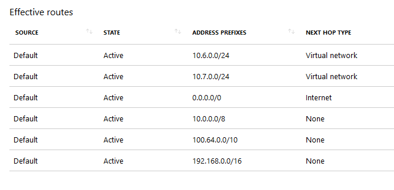

Simulating Forced Tunneling in Azure
======================

## Table of content

- [Introduction / Context](#Introduction-/-Context)
- [Test Environment Overview](Test-Environment-Overview)
- [Setting up the Test Environment](Setting-up-a-Test-Environment)

## Introduction / Context

By default, when a Virtual Network is created in Azure, subnets within the VNet have a set of system routes associated with them that allow for routing of traffic directly to the internet. See below for an example of what the effective routes look like for a VM running with the default system routes:

Notice that the system default route specifies the 0.0.0.0/0 address prefix. With this route in place, traffic for any address not specified by an address range within a virtual network will route to the Internet with one exception. If the destination address is for one of Azure's services, Azure routes the traffic directly to the service over Azure's backbone network, rather than routing the traffic to the Internet. Traffic between Azure services does not traverse the Internet, regardless of which Azure region the virtual network exists in, or which Azure region an instance of the Azure service is deployed in.

Microsoft uses the term "Forced Tunneling" to describe a network configuration in which all traffic originating in Azure that is destined for the internet is forced back to an on-premises network (and typically on an premises network edge security stack).

This is an extremely common configuration for enterprise customers who have internal security policy dictating all traffic passing between private and public address space is audited / filtered, etc.

For ExpressRoute connections, forced tunneling is implemented by publishing a default route that propagates to all connected VNets. This default route overrides the "0.0.0.0/0 -> Internet" system route and instead forces all traffic down the ExpressRoute circuit.

Herein lies the rub. When we override the default route to the internet, we not only remove the ability for traffic to get to the internet, we also remove connectivity to the Microsoft backbone and any Azure services that may be running there.

This has a host of side effects for workloads running in the affected subnets. 

For example:
- [Azure based RedHat update servers cannot be reached by VM's trying to install packages](https://github.com/MicrosoftDocs/azure-docs/issues/11969)
- [Azure based KMS servers cannot be reached by VM's trying to activate](https://docs.microsoft.com/en-us/azure/virtual-machines/troubleshooting/custom-routes-enable-kms-activation)
- Multitenant Azure services like Azure storage, Azure SQL DB, Azure Key Vault cannot be accessed.
- VNet Injected services running within your VNet cannot talk to control plane services that are running on the Microsoft network and are required for their ongoing management.

The range of mitigation techniques for re-enabling communication in the above scenarios is outside the scope of this article but includes the use of user defined routes, network virtual appliances and network security groups.

Due to the fact that there is such broad reaching impact associated with "forced tunneling" it's often nescassary to test the impact of removal of the default internet route. 

Fortunately, this is relatively easy to do even without access to an environment that includes site-to-site VPN connectivity or ExpressRoute circuits.

## Test Environment Overview

This article will walk you through deploying a test network with the following characteristics:

- A single VNet (TestVnet)
- Three Subnets
    - proxy-subnet - For hosting a proxy server
    - workload-subnet - For hosting test workloads with no route to the internet
    - infra-subnet - for hsoting other infrastructure servers that require internet connectivity
- All subnets can route to one another
- Each subnet has a dedicated NSG to control traffic flows

## Setting up the Test Environment

