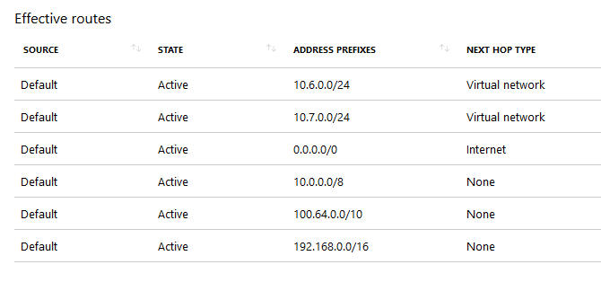

Simulating Forced Tunneling in Azure
======================

## Table of content

- [Introduction / Context](#Introduction-/-Context)
- [Test Environment Overview](Test-Environment-Overview)
- [Setting up the Test Environment](Setting-up-a-Test-Environment)
- [Testing](Testing)
## Introduction / Context

By default, when a Virtual Network is created in Azure, subnets within the VNet have a set of system routes associated with them that allow for routing of traffic directly to the internet. See below for an example of what the effective routes look like for a VM running with the default system routes:



Notice that the system default route specifies the 0.0.0.0/0 address prefix. With this route in place, traffic for any address not specified by an address range within a virtual network will route to the Internet with one exception. If the destination address is for one of Azure's services, Azure routes the traffic directly to the service over Azure's backbone network, rather than routing the traffic to the Internet. Traffic between Azure services does not traverse the Internet, regardless of which Azure region the virtual network exists in, or which Azure region an instance of the Azure service is deployed in.

Microsoft uses the term "Forced Tunneling" to describe a network configuration in which all traffic originating in Azure that is destined for the internet is forced back to an on-premises network (and typically on an premises network edge security stack).

This is an extremely common configuration for enterprise customers who have internal security policy dictating all traffic passing between private and public address space is audited / filtered, etc.

For ExpressRoute connections, forced tunneling is implemented by publishing a default route that propagates to all connected VNets. This default route overrides the "0.0.0.0/0 -> Internet" system route and instead forces all traffic down the ExpressRoute circuit.

Herein lies the issue. When we override the default route to the internet, we not only remove the ability for traffic to get to the internet, we also remove connectivity to the Microsoft backbone and any Azure services that may be running there.

This has a host of side effects for workloads running in the affected subnets. 

For example:
- [Azure based RedHat update servers cannot be reached by VM's trying to install packages](https://github.com/MicrosoftDocs/azure-docs/issues/11969)
- [Azure based KMS servers cannot be reached by VM's trying to activate](https://docs.microsoft.com/en-us/azure/virtual-machines/troubleshooting/custom-routes-enable-kms-activation)
- Multitenant Azure services like Azure storage, Azure SQL DB, Azure Key Vault cannot be accessed.
- VNet Injected services running within your VNet cannot talk to control plane services that are running on the Microsoft network and are required for their ongoing management.

The range of mitigation techniques for re-enabling communication in the above scenarios is outside the scope of this article but includes the use of user defined routes, network virtual appliances and network security groups.

Due to the fact that there is such broad reaching impact associated with "forced tunneling" it's often necessary to test the impact of removal of the default internet route. 

Fortunately, this is relatively easy to do even without access to an environment that includes site-to-site VPN connectivity or ExpressRoute circuits.

## Test Environment Overview

This article will walk you through deploying a test network with the following characteristics:

- A single VNet (TestVnet)
- Three Subnets
    - workload-subnet (10.0.0.0/24)
        - For hosting test workloads that will run in a forced tunneling environment
        - This subnet has no direct connectivity ot the internet. Internet connectivity is blocked by a default route that sends traffic to "none" as well as an outgoing security group rule that denies outbound traffic to the internet.
    - proxy-subnet (10.0.1.0/24)
        - For hosting a proxy server that can be used to facilitate http/https connectivity from hosts running in the workload subnet
        - This subnet has access to the internet through the default system route and open outgoing NSGs.
    - infra-subnet (10.0.2.0/24)
        - For hosting other infrastructure servers that might need access to the internet.
        - This subnet has access to the internet through the default system route and open outgoing NSGs.
- All subnets can route to one another by default
- Each subnet has a dedicated NSG to control traffic flows

## Setting up the Test Environment

The below assumes you're using a linux command line (bash).

1. Clone this repo:
``` bash
git clone https://github.com/kskvarci/forcedtunneltest.git
```

2. Open and modify scripts\/testnet.sh with your favorite editor. At the top of the file in the variables section replace the xxx.xxx.xxx.xxx section w/ your internet facing IP address. This IP will be used to create an NSG rule to allow you to SSH into your proxy server.
``` bash
# Variables
location="eastus2"
resourceGroupName="TestNet-Rg"
vnetName="TestVnet"
sourceIP="xxx.xxx.xxx.xxx/32"
```
3. Run testnet.sh to deploy the network.
``` base
./testnet.sh
```
4. Open and modify deploysquid.sh. In the variables section replace the userName and sshKey variables w/ your values.
``` bash
# Variables
location="eastus2"
resourceGroupName="TestNet-Rg"
vnetName="TestVnet"
userName="your username here"
sshKey="your public ssh key here"
```
5. Open the squid-cloud-init.yml file. In the content section that writes allow-domains-regex.txt, adjust the regex based url whitelist to a set of URLs that suites your testing.
``` yaml
#cloud-config

# This file is used by cloud-init to install and configure squid proxy.

packages:
 - squid

write_files:
-   content: |
        #source ACLs
        acl trusted src 10.0.0.0/8

        #proxy protocol config
        http_port 3128

        #destination ACLs
        acl whitelistre dstdom_regex "/etc/squid/allow-domains-regex.txt"

        #squid access
        http_access deny to_localhost
        http_access allow all

        #squid traffic routing
        always_direct allow whitelistre
        never_direct allow all

        # Leave coredumps in the first cache dir
        coredump_dir /var/spool/squid
       
        #keep last 5 days or rotated logs
        #crontab set to rotate daily
        logfile_rotate 5
        strip_query_terms off
    path: /etc/squid/squid.conf
-   content: |
        (^|\.)microsoft\.com
        (^|\.)blob\.core\.windows\.net
        (^|\.)core\.windows\.net
        (^|\.)azurewebsites\.net
        (^|\.)azurewebsites\.windows\.net
        (^|\.)youtube\.com
    path: /etc/squid/allow-domains-regex.txt

runcmd:
 - /usr/sbin/squid -k reconfigure
```
6. Run deploysquid.sh to deploy and configure a squid proxy server to the proxy subnet.
``` bash
./deploysquid.sh
```
## Testing
Testing recommendations